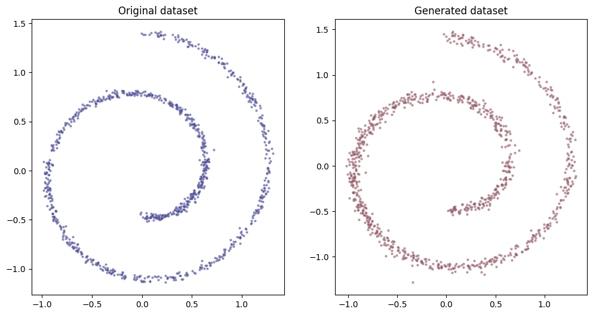

# Exploring how KANs (Kolmogorov-Arnold Networks) can be used in Denoising Diffusion Models

This repo is essentially ["An Introduction to Diffusion Models"](https://marziosala.github.io/swiss-roll/),

BUT WITH KAN! (and without, for comparison)

Because KAN makes everything better! (Seems to be so indeed in our diffusion case! - skip to the bottom or to [the notebook](kan-diffusion.ipynb))

*Akshually, it's simply an experiment on MLP approximating the noise, and the choice of diffusion model doesn't really matter as long as it predicts the needed functions*

## Setup

Because we cannot afford +100500 GPUs and the entire Laion *X*B dataset, let's start small and use the swiss roll dataset used in the very original Diffusion paper.

It is corrupted by Gaussian noise.

## Training and KAN-results

Our KAN-based  model consists of the MLP, all of whose linear layers have been replaced by KAN-layers.

It trains to restore the noised pictures.

And quite successfully!

## Vanilla MLP comparison

Now let's train an MLP with *the same structure* (multilayered)

But, the loss and the results look slightly worse!

Note, the number of parameters of the structures above differ!

KAN has 22080.

MLP has 2306.

We need to even them out ([like we did with GPT](https://github.com/kabachuha/nanoGPKANT)) before jumping to the conclusions.

## Now, we try small two-layer KAN

To balance its count of parameters with MLP, we cross out all the inner layers, leaving only two layers, similar to the KAN paper's authors.

This model has only 1600 parameters, less than the MLP!

The results look slightly worse, but it's just two layer and should be more interpretable! (TODO: me, or delegate to pykan)

## Comparison of the loss curves

And now, finally! A quantitative metric! The loss curves.

As we can see, KAN fare as good or better than the similar MLP structures in predicting denoising.

## How to train your own KAN-diffusion?

To play around use the kan-diffusion.ipynb notebook (colab-launchable, as always). All trainings — even of KANs — take no more than 2 minutes on my PC.

## ...

Will KANs assist us in prompting anime girls by Greg Rutkowski? Only time will tell...
